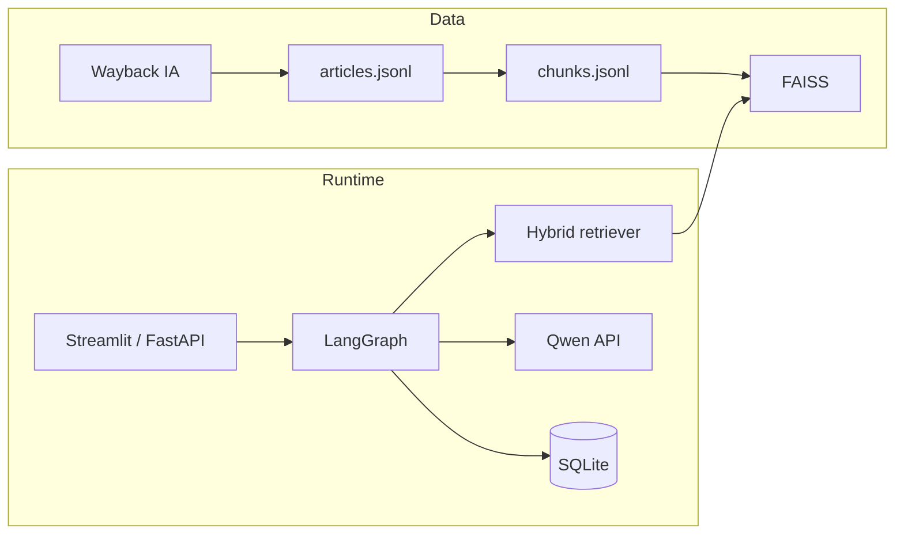

# Coinbase Support Agent

Production-style **conversational support agent** for **Coinbase Help Center** topics, built for an LLM applications course. It combines **RAG (FAISS + hybrid retrieval)**, **LangGraph orchestration**, **guardrails**, **mock operational actions**, **SQLite session memory**, and a **Streamlit** UI with optional **FastAPI** backend.

**Disclaimer:** Educational demo — not affiliated with Coinbase. Answers are grounded in **archived public snapshots** of `help.coinbase.com` (Internet Archive); live pages may differ.

## Features

| Capability | Description |
|------------|-------------|
| **Intent routing** | Structured router → `KB_QA`, actions, `AMBIGUOUS`, `OUT_OF_SCOPE`, `UNSAFE`, `SECURITY_SENSITIVE` |
| **KB Q&A** | Retrieved evidence only + citations (article title, section, canonical URL) |
| **Actions** | Check transaction (mock DB), create ticket (SQLite), onboarding plan (RAG + checklist), multi-turn account recovery |
| **Memory** | Per-session transcripts + traces persisted in SQLite |
| **Guardrails** | Regex prescreen + LLM safety JSON; refusals for injection, bypass, illegal, investment advice |
| **Evaluation** | 17 cases (16 agent + 1 smoke): metrics JSON, CSV, `failure_analysis.md`, optional `eval_metrics_chart.png` |
| **Deployment** | Docker Compose, health check, password-gated UI |

## Architecture

See [docs/architecture.md](docs/architecture.md) and [docs/design_decisions.md](docs/design_decisions.md).



```text
scraper/          # Wayback ingestion, seed URLs, robots logging
app/
  agent/          # LangGraph, router, guardrails, QA
  actions/        # Transaction, ticket, onboarding, recovery
  retrieval/      # Chunking, embeddings, FAISS, hybrid retriever
  llm/            # OpenAI-compatible client (Qwen endpoint)
  storage/        # SQLite sessions / tickets / recovery / mock txs
  eval/           # Test cases + runner
backend/          # FastAPI
frontend/         # Streamlit
deployment/       # Dockerfile, docker-compose
data/
  corpus/         # articles.jsonl + manifest (generated)
  index/          # faiss.index + faiss_meta.jsonl (generated)
  mock/           # seed transactions JSON
```

## Course requirements mapping

| Requirement | Where it’s implemented |
|-------------|-------------------------|
| ≥50 KB documents (≥60 target) | `python -m scraper.ingest` → `data/corpus/articles.jsonl` + `manifest.csv` |
| Intent classification & routing | `app/agent/router.py`, `app/agent/graph.py` (`Intent` enum + trace) |
| KB QA + citations | `app/agent/qa.py`, `app/retrieval/retriever.py`, UI source panel |
| ≥3 mock actions | Transaction, ticket, onboarding, recovery (`app/actions/`) |
| Multi-turn (2+ slots) | `app/actions/recovery.py` + SQLite `recovery_cases` |
| Conversation memory | SQLite `sessions`; Streamlit session picker; citation / ticket / recovery recall in `graph.py` |
| Guardrails | `app/agent/guardrails.py` (regex + LLM), logged categories |
| Error handling | Validators in actions, KB/router fallbacks, `run_agent_turn` graph wrapper |
| 10–15+ eval cases | `app/eval/test_cases.json` (17), `python -m app.eval` |
| Deployment + password gate | `deployment/`, `DEMO_PASSWORD`, Streamlit unlock |
| Qwen endpoint | `LLM_BASE_URL` default in `.env.example` (OpenAI-compatible client) |

## Requirements

- **Python 3.11+** (3.12 tested)
- Course LLM endpoint (OpenAI-compatible), e.g. Qwen: set `LLM_BASE_URL` / `LLM_API_KEY` in `.env`
- Network for **first-time** ingestion (Internet Archive) and **embedding model** download

## Quick start

```bash
python3 -m venv .venv
source .venv/bin/activate   # Windows: .venv\Scripts\activate
pip install -r requirements.txt
cp .env.example .env
# Edit .env — set LLM_API_KEY if your endpoint requires it
```

### 1) Ingest knowledge base (60+ articles)

Live Help Center is often **Cloudflare-protected** for bots; the pipeline uses **Internet Archive** `id_` captures and logs robots handling in `data/corpus/robots_check.json`.

```bash
export PYTHONPATH=.
python -m scraper.ingest --out data/corpus --min-articles 60 --max-discover 200
```

- **Resume:** Re-run the same command; existing URLs in `articles.jsonl` are skipped.
- **Fresh run:** `python -m scraper.ingest --no-resume --out data/corpus ...`

Outputs:

- `data/corpus/articles.jsonl` — cleaned documents  
- `data/corpus/manifest.csv` / `manifest.json` — URL, title, category, Wayback timestamp, status  
- `scraper/seed_urls.txt` — fallback URL list merged with discovery

### 2) Chunk + build FAISS index

```bash
python scripts/build_kb.py
```

Produces `data/index/faiss.index` and `data/index/faiss_meta.jsonl`.

### 3) Run API + UI

```bash
# Terminal A
uvicorn backend.main:app --reload --host 0.0.0.0 --port 8000

# Terminal B
streamlit run frontend/streamlit_app.py
```

- API docs: [http://127.0.0.1:8000/docs](http://127.0.0.1:8000/docs)  
- Health: [http://127.0.0.1:8000/health](http://127.0.0.1:8000/health)  
- UI unlock password: `DEMO_PASSWORD` in `.env` (default `changeme`)

In Streamlit, choose **In-process agent** (no API) or **FastAPI backend** and set `API_BASE` if needed.

### 4) Retrieval smoke test

```bash
python app/eval/retrieval_eval.py --out data/eval/retrieval_eval.csv
```

### 5) Full scenario evaluation

Requires a working LLM endpoint (router, QA, safety).

```bash
python -m app.eval
```

Artifacts: `data/eval/eval_results.csv`, `eval_summary.json`, `eval_metrics.json`, `failure_analysis.md`, and `eval_metrics_chart.png` (if `matplotlib` is installed).

Via API (can take several minutes):

```bash
curl -X POST http://127.0.0.1:8000/v1/eval/run -H "Content-Type: application/json" -d '{}'
```

## Embeddings

Default: **`BAAI/bge-small-en-v1.5`** — strong English retrieval quality at modest size; runs locally via `sentence-transformers`. Override with `EMBEDDING_MODEL` in `.env`.

## Docker

See [deployment/README.md](deployment/README.md).

```bash
docker compose -f deployment/docker-compose.yml up --build
```

Mount `data/` as a volume and run ingest + `build_kb` once inside the container or before compose.

## Documentation

| Doc | Purpose |
|-----|---------|
| [docs/architecture.md](docs/architecture.md) | End-to-end design |
| [docs/demo_script.md](docs/demo_script.md) | 5-minute demo flow |
| [docs/presentation_notes.md](docs/presentation_notes.md) | Slide bullets |
| [docs/team_handoff.md](docs/team_handoff.md) | Module map for Q&A |
| [docs/demo_transcripts.md](docs/demo_transcripts.md) | Example turns |

## Environment variables

See [.env.example](.env.example) for `LLM_*`, `EMBEDDING_MODEL`, `RETRIEVAL_TOP_K`, `RERANK_TOP_N`, `DEMO_PASSWORD`, paths.

## Limitations

- Corpus is **historical** (Wayback); not real-time Help Center.
- **Mock** transactions/tickets/recovery — not connected to Coinbase production.
- **LLM variance** may affect router/safety/eval pass rates; tune prompts and thresholds as needed.

## Attribution

Built with [FastAPI](https://fastapi.tiangolo.com/), [Streamlit](https://streamlit.io/), [LangGraph](https://github.com/langchain-ai/langgraph), [FAISS](https://github.com/facebookresearch/faiss), [sentence-transformers](https://www.sbert.net/), [httpx](https://www.python-httpx.org/), and public **Internet Archive** snapshots of Coinbase Help pages.
