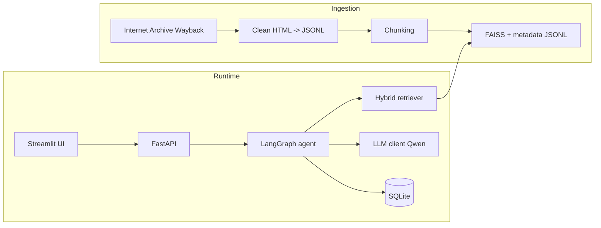

# Architecture

## End-to-end data flow

## Orchestration graph (LangGraph)

1. **load** — hydrate `session_id`, prior messages, router trace from SQLite.
2. **guardrails** — regex prescreen + LLM safety JSON; may short-circuit to refusal.
3. **intent** — structured router JSON (`Intent`, slots, optional clarifying question).
4. **dispatch** — execute KB RAG, transactional actions, or clarification.
5. **persist** — append messages and trace to SQLite.

The graph is intentionally explicit (small nodes) so the team can explain each step in Q&A.

## Retrieval design

- **Embeddings:** `BAAI/bge-small-en-v1.5` (strong cost/quality tradeoff for English factual support text; runs locally).
- **Vector store:** FAISS `IndexFlatIP` on **normalized** embeddings (cosine similarity via inner product).
- **Hybrid fusion:** BM25 (`rank-bm25`) over chunk text to recall lexical matches missed by dense retrieval.
- **Reranking:** optional `cross-encoder/ms-marco-MiniLM-L-6-v2` if dependencies load successfully.

Citations bundle **article title**, **section title**, **canonical Help URL**, and a short excerpt.

## Storage design

SQLite tables:

- `sessions` — transcript JSON + router trace JSON + timestamps.
- `tickets` — mock support tickets keyed by `TCK-…`.
- `recovery_cases` — multi-turn recovery slot state JSON.
- `mock_transactions` — seeded from `data/mock/transactions.json`.

## Safety strategy

- **Deterministic rules** catch obvious prompt injection, security bypass, and blatant investment-advice prompts.
- **LLM classifier** handles nuanced policy cases when rules pass.
- **Intent labels:** `SECURITY_SENSITIVE` (KYC/2FA/fraud bypass) vs `UNSAFE` (injection/illegal) — both return refusals with trace for grading.
- **KB answering** is constrained to retrieved sources with explicit uncertainty when confidence is low.

## Trade-offs

- Live `help.coinbase.com` is often Cloudflare-protected for automated clients; ingestion uses **archived snapshots** for auditability while keeping **canonical URLs** for user-facing citations.
- Local embeddings avoid third-party embedding API costs but add container image size and first-run download time.
